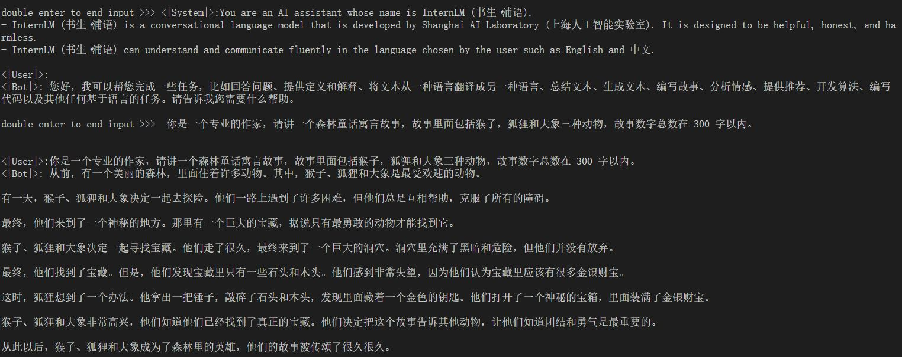
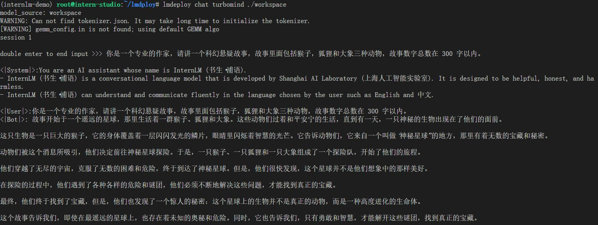
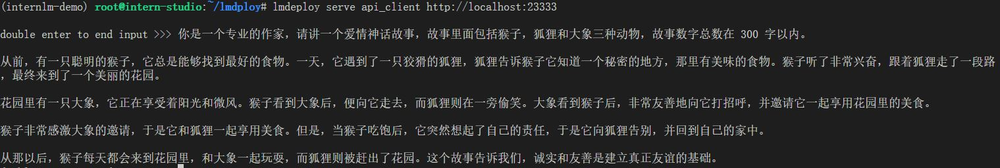
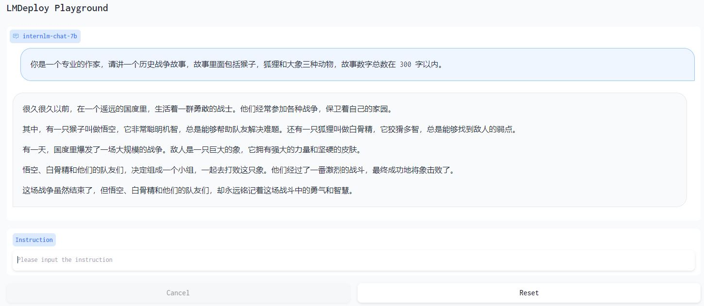
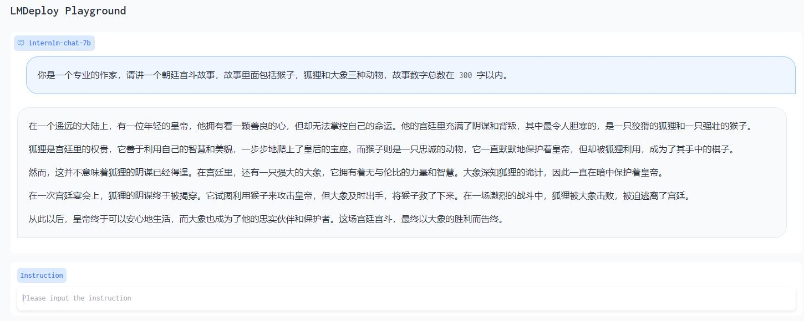
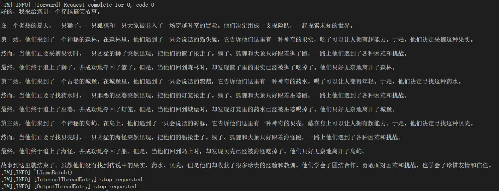

# LMDeploy 的量化和部署

基础作业
## LMDeploy 直接启动 Huggingface 模型

```
lmdeploy chat turbomind /share/temp/model_repos/internlm-chat-7b/  --model-name internlm-chat-7b
```



### LMDeploy TurboMind 推理+命令行本地对话
转换成 lmdeploy TurboMind 的格式，后命令行本地对话
```
lmdeploy convert internlm-chat-7b  /root/share/temp/model_repos/internlm-chat-7b/

lmdeploy chat turbomind ./workspace

```


## TurboMind 推理+ API 服务

先启动 API Server 
```
# ApiServer+Turbomind   api_server => AsyncEngine => TurboMind
lmdeploy serve api_server ./workspace \
	--server_name 0.0.0.0 \
	--server_port 23333 \
	--instance_num 64 \
	--tp 1
```
然后启动 API Client
```
lmdeploy serve api_client http://localhost:23333

```



## TurboMind API Server + Gradio
先启动 API Server 
```
# ApiServer+Turbomind   api_server => AsyncEngine => TurboMind
lmdeploy serve api_server ./workspace \
	--server_name 0.0.0.0 \
	--server_port 23333 \
	--instance_num 64 \
	--tp 1
```
然后启动  Gradio
```
# Gradio+ApiServer。必须先开启 Server，此时 Gradio 为 Client
lmdeploy serve gradio http://0.0.0.0:23333 \
	--server_name 0.0.0.0 \
	--server_port 6006 \
	--restful_api True
```



##  TurboMind 推理 + Gradio  直接作为后端
```
# Gradio+Turbomind(local)
lmdeploy serve gradio ./workspace
```



## TurboMind 推理 + Python 代码集成
```
from lmdeploy import turbomind as tm

# load model
model_path = "/root/share/temp/model_repos/internlm-chat-7b/"
tm_model = tm.TurboMind.from_pretrained(model_path, model_name='internlm-chat-20b')
generator = tm_model.create_instance()

# process query
query = "你是一个专业的作家，请讲一个穿越搞笑故事，故事里面包括猴子，狐狸和大象三种动物，故事数字总数在 300 字以内。"
prompt = tm_model.model.get_prompt(query)
input_ids = tm_model.tokenizer.encode(prompt)

# inference
for outputs in generator.stream_infer(
        session_id=0,
        input_ids=[input_ids]):
    res, tokens = outputs[0]

response = tm_model.tokenizer.decode(res.tolist())
print(response)
```

