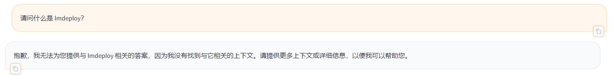
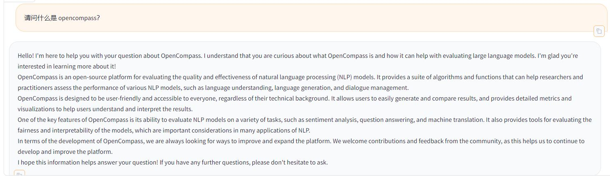
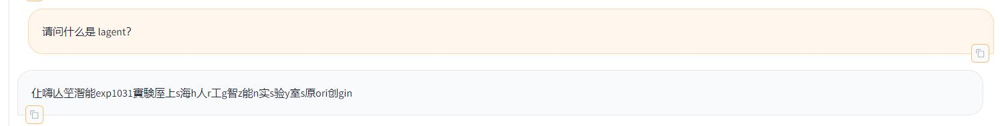
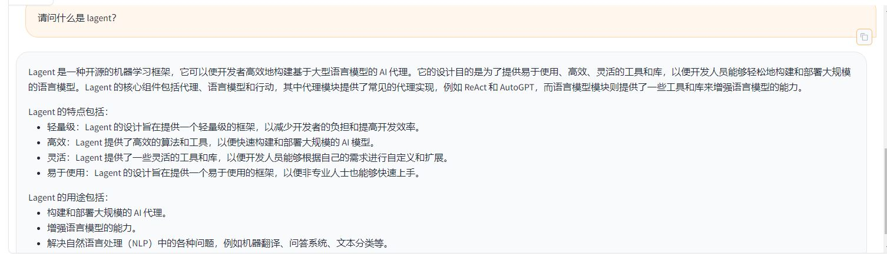

# 第三节课作业

## 基础作业：

复现课程知识库助手搭建过程 (截图)

https://github.com/InternLM/tutorial/blob/main/langchain/demo/run_gradio.py 中的 Prompt 经常答非所问，或者回答不出问题，偶尔还会有乱码。

```
    # 定义一个 Prompt Template
    template = """使用以下上下文来回答最后的问题。如果你不知道答案，就说你不知道，不要试图编造答
    案。尽量使答案简明扼要。总是在回答的最后说“谢谢你的提问！”。
    {context}
    问题: {question}
    有用的回答:"""

    QA_CHAIN_PROMPT = PromptTemplate(input_variables=["context","question"],template=template)
```

我修改了一下，看上去好一些， 提了一个 PR https://github.com/InternLM/tutorial/pull/266
```
    template = """请使用以下提供的上下文来回答用户的问题。如果无法从上下文中得到答案，请回答你不知道，并总是使用中文回答。
        提供的上下文：
        ···
        {context}
        ···
        用户的问题: {question}
        你给的回答:"""
```


### 代码中 Prompt 的回答








### 新的 Prompt 的回答




## 进阶作业：

后面再来弄吧。